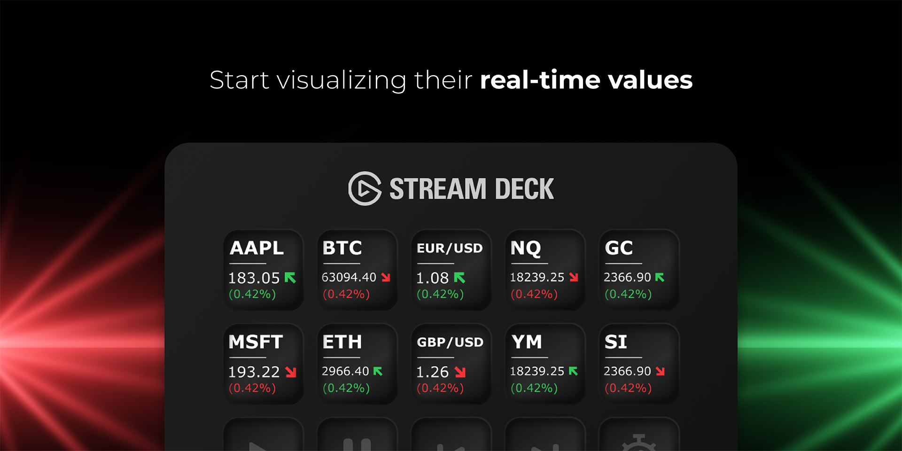
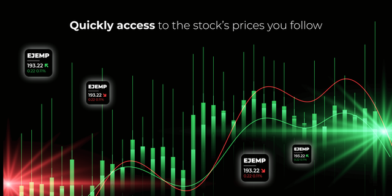

# TICKERTAP
A Stream Deck plugin to visualize real-time asset values

>)

## Installation

You can install the TickerTap plugin for StreamDeck by following one of the two methods described below:

### Option 1: Manual Download

1. Visit the following URL to download the latest version of the plugin:
   [Download TickerTap](https://marketplace.elgato.com/product/tickertap-edbea047-025e-4b44-bc49-5e77d75a270f)
2. After the download is complete, navigate to your downloads folder.
3. Double-click on `com.matextrem.tickertap.streamDeckPlugin` to install the plugin on your Stream Deck.

### Option 2: Click on the Download Button

Click on the button below to download the latest version of the plugin directly:

## Features

- Visualize any real-time asset values.
- Quick access to the asset prices you follow.
- Support the following types from [Finvinz](https://finviz.com) (American market) and [Investing.com](https://www.investing.com/) (European and Asian markets):
  - Stock
  - Forex
  - Commodities
  - Futures
- Support cryptocurrencies from [CoinMarketCap](https://coinmarketcap.com/)

  **NO API KEY IS NEEDED! 🎊**

## Usage

- Ticker field supports Finvinz and Investing.com (for Europe and Asia markets) websites: e.g.
  - Stocks
    - **AAPL** - Apple
    - **GOOGL** - Alphabet
  - Forex
    - **EURUSD** - EUR/USD
    - **XAUUSD** - XAU/USD
  - Commodities
    - **GC** - Gold
    - **SI** - Silver
  - Futures
    - **ES** - E-mini S&P 500
    - **NQ** - E-mini Nasdaq 100
  - Crypto
    - Ticker field supports CoinMarketCap website. You have to get the name from the url: e.g.
         - **BITCOIN** -  coinmarketcap.com/currencies/bitcoin
         - **ETHEREUM** - coinmarketcap.com/currencies/ethereum
         - **THE-GRAPH** - coinmarketcap.com/currencies/the-graph
- Region: Select the region where the stocks market is from:
     - **America** -  United States
     - **Europe** - European Union and UK
     - **Asia/Pacific** - Asia and Pacific
  
     **Note:** For EU and Asia markets, the ticker should be extracted from Investing.com url: e.g.
     - **BASF-AG** - investing.com/equities/basf-ag
     - **IHI-CORP.** - investing.com/equities/ihi-corp.
- Show as: Add custom ticker - e.g **GOLD**.
- Icon: Show/Hide the ticker icon if exists.
- Frequency: How often the stock prices are fetched: e.g.
  - **On push** - _Every time the key button is pressed (default)_.
  - **5 minutes** - _Every 5 minutes_.
  - **30 minutes** - _Every 30 minutes_.
  - **1 hour** - _Hourly_.

## Maintainers

- [Mati Dastugue](https://github.com/matextrem) (Developer)
- [Mariana Gurksnis](https://marianagurksnis.com/) (Graphic Designer)

## Contributors

- <https://github.com/matextrem/streamdeck-tickertap/contributors>

## Contributing

For more details about how to contribute, please read
<https://github.com/matextrem/streamdeck-tickertap/blob/main/CONTRIBUTING.md>.

## License

The plugin is available as open source under the terms of the
[MIT License](https://opensource.org/licenses/MIT). A copy of the license can be
found at <https://github.com/matextrem/streamdeck-tickertap/blob/main/LICENSE.md>.

## Code of Conduct

Everyone interacting in the plugin project's codebases, issue trackers, chat
rooms and mailing lists is expected to follow the
[code of conduct](https://github.com/matextrem/plugin/blob/main/CODE_OF_CONDUCT.md).
